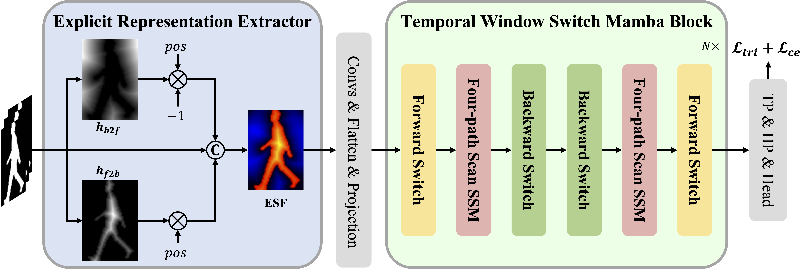

<div align="center">

# MambaGait

## MambaGait: Gait recognition approach combining explicit representation and implicit state space model

[Haijun Xiong](https://scholar.google.com/citations?hl=zh-CN&user=GDTyz2kAAAAJ),
[Bin Feng](https://scholar.google.com/citations?hl=zh-CN&user=nRc8u6gAAAAJ)  <sup>✉️</sup>,
[Bang Wang](https://scholar.google.com/citations?hl=zh-CN&user=GPycMSIAAAAJ),
[Wenyu Liu](https://scholar.google.com/citations?hl=zh-CN&user=nRc8u6gAAAAJ),
[Xinggang Wang](https://scholar.google.com/citations?hl=zh-CN&user=qNCTLV0AAAAJ)

[School of EIC, HUST](http://eic.hust.edu.cn/)

---

<div align="left">

## Abstract

Gait recognition aims to identify pedestrians based on their unique walking patterns and has gained significant attention due to its wide range of applications. Mamba, a State Space Model, has shown great potential in modeling long sequences. However, its limited ability to capture local details hinders its effectiveness in fine-grained tasks like gait recognition. Moreover, similar to convolutional neural networks and transformers, Mamba primarily relies on implicit learning, which is constrained by the sparsity of binary silhouette sequences. Inspired by explicit feature representations in scene rendering, we introduce a novel gait descriptor, the Explicit Spatial Representation Field (ESF). It represents silhouette images as directed distance fields, enhancing their sensitivity to gait motion and facilitating richer spatiotemporal feature extraction. To further improve Mamba's ability to capture local details, we propose the Temporal Window Switch Mamba Block (TWSM), which effectively extracts local and global spatiotemporal features via bidirectional temporal window switching. By combining explicit representation and implicit Mamba modeling, MambaGait achieves state-of-the-art performance on four challenging datasets (GREW, Gait3D, CCPG, and SUSTech1K).


---

## Framework




## Results

<div align="left">

### 1. Results on GREW
| Method     | Venue    | Rank-1 | Rank-5 |
| :--------- | :------- | :----- | :----- |
| GaiSet     | AAAI19   | 46.3   | 63.6   |
| GaitPart   | CVPR20   | 44.0   | 60.7   |
| GaitGL     | ICCV21   | 47.3   | 63.6   |
| MTSGait    | ACM MM22 | 55.3   | 71.3   |
| GaitBase   | CVPR23   | 60.1   | -      |
| GaitGCI    | CVPR23   | 68.5   | 80.8   |
| HSTL       | ICCV23   | 62.7   | 76.6   |
| DyGait     | ICCV23   | 71.4   | 83.2   |
| GaitCSV    | ACM MM23 | 64.9   | -      |
| SwinGait   | ArXiv23  | 79.3   | 88.9   |
| CLASH      | TIP24    | 67.0   | 78.9   |
| QAGait     | AAAI24   | 59.1   | 74.0   |
| VPNet      | CVPR24   | 80.0   | 89.4   |
| **Ours**   | -        | **80.5** | **89.8** |


### 2. Results on Gait3D
| Method      | Venue    | Rank-1 | Rank-5 | mAP  | mINP |
| :---------- | :------- | :----- | :----- | :--- | :--- |
| GaiSet      | AAAI19   | 36.7   | 58.3   | 30.0 | 17.3 |
| GaitPart    | CVPR20   | 28.2   | 47.6   | 21.6 | 12.4 |
| GaitGL      | ICCV21   | 29.7   | 48.5   | 22.3 | 13.3 |
| SMPLGait    | CVPR22   | 46.3   | 64.5   | 37.2 | 22.2 |
| MTSGait     | ACM MM22 | 48.7   | 67.1   | 37.6 | 21.9 |
| DANet       | CVPR23   | 48.0   | 69.7   | -    | -    |
| GaitBase    | CVPR23   | 64.6   | -      | -    | -    |
| GaitGCI     | CVPR23   | 50.3   | 68.5   | 39.5 | 24.3 |
| HSTL        | ICCV23   | 61.3   | 76.3   | 55.5 | 34.8 |
| DyGait      | ICCV23   | 66.3   | 80.8   | 56.4 | 37.3 |
| GaitCSV     | ACM MM23 | 69.1   | -      | 59.7 | 34.0 |
| SwinGait    | ArXiv23  | 75.0   | 86.7   | 67.2 | -    |
| CLASH       | TIP24    | 52.4   | 69.2   | 40.2 | 24.9 |
| HybridGait  | AAAI24   | 53.3   | 72.0   | 43.3 | 26.7 |
| QAGait      | AAAI24   | 67.0   | 81.5   | 56.5 | -    |
| VPNet       | CVPR24   | 75.4   | 87.1   | -    | -    |
| **Ours**    | -        | **76.7** | **90.1** | **70.8** | **50.6** |


### 3. Results on CCPG
| Method     | Venue   | CL   | UP   | DN   | BG   | Mean | CL   | UP   | DN   | BG   | Mean |
| :--------- | :------ | :--- | :--- | :--- | :--- | :--- | :--- | :--- | :--- | :--- | :--- |
| GaitSet    | AAAI19  | 60.2 | 65.2 | 65.1 | 68.5 | 64.8 | 77.5 | 85.0 | 82.9 | 87.5 | 83.2 |
| GaitPart   | CVPR20  | 64.3 | 67.8 | 68.6 | 71.7 | 68.1 | 79.2 | 85.3 | 86.5 | 88.0 | 84.8 |
| GaitBase   | CVPR23  | 71.6 | 75.0 | 76.8 | 78.6 | 75.5 | 88.5 | 92.7 | 93.4 | 93.2 | 92.0 |
| SwinGait   | ArXiv23 | 68.5 | 76.3 | 72.5 | 85.3 | 75.7 | 83.8 | 92.1 | 86.0 | 95.7 | 89.4 |
| **Ours**   | -       | **79.5** | **85.4** | **81.3** | **91.1** | **84.3** | **90.8** | **96.7** | **92.2** | **97.4** | **94.2** |

### 4. Results on SUSTech1K
| Method   | Venue   | Normal | Bag  | Clothing | Carrying | Umbrella | Uniform | Occlusion | Night | Overall |
| :------- | :------ | :----- | :--- | :------- | :------- | :------- | :------ | :-------- | :---- | :------ |
| GaitSet  | AAAI19  | 69.1   | 68.2 | 37.4     | 65.0     | 63.1     | 61.0    | 67.2      | 23.0  | 65.0    |
| GaitPart | CVPR20  | 62.2   | 62.8 | 33.1     | 59.5     | 57.2     | 54.8    | 57.2      | 21.7  | 59.2    |
| GaitGL   | ICCV21  | 67.1   | 66.2 | 35.9     | 63.3     | 61.6     | 58.1    | 66.6      | 17.9  | 63.1    |
| GaitBase | CVPR23  | 81.5   | 77.5 | 49.6     | 75.8     | 75.5     | 76.7    | 81.4      | 25.9  | 76.1    |
| SwinGait | ArXiv23 | 78.0   | 74.1 | 35.0     | 71.4     | 71.8     | 73.5    | 78.1      | 26.7  | 71.5    |
| **Ours** | -       | **88.3** | **86.0** | **55.2** | **82.8** | **87.0** | **88.3** | **90.5** | **29.4** | **83.6** |


---
## Citation

If you find our paper and code useful for your research, please consider giving this repo a star :star: or citing :pencil::

```BibTeX
@article{xiong2025mambagait,
  title = {MambaGait: Gait recognition approach combining explicit representation and implicit state space model},
  author = {Xiong, Haijun and Feng, Bin and Wang, Bang and Wang, Xinggang and Liu, Wenyu},
  journal = {Image and Vision Computing},
  volume = {161},
  pages = {105597},
  year = {2025}
}
```

---


## Acknowledgements

<div align="left">

The development of MambaGait is built on [OpenGait](https://github.com/ShiqiYu/OpenGait), and we are thankful for the remarkable work of the prior project.